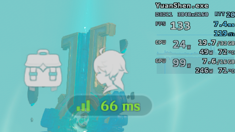
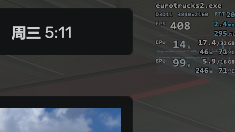
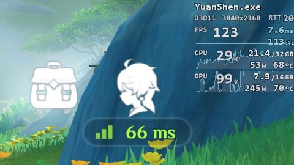
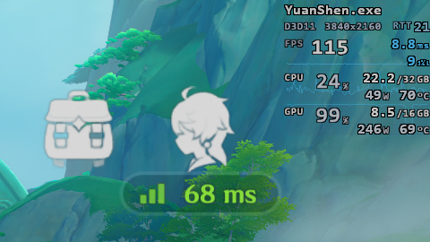

# My RivaTuner Overlays

自用 RTSS / RivaTuner Statistics Server overlay 配置，基于模板生成自定义 `.ovl` 文件。

English version: [README.en.md](README.en.md)


## 示例

`my.ovl`（HDR）





`my.ovl`（SDR）



`my-opacity100.ovl`（HDR）



## 说明

- 我的是 4K 屏幕，其他分辨率或缩放比例下可能需要自己调整。
- 这个配置不需要 MSI Afterburner，但应该需要 [RTSS 7.3.7 或更高版本](https://www.guru3d.com/download/rtss-rivatuner-statistics-server-download/)。
- 没有做数据源兼容，目前只依赖 RTSS 内置的 internal HAL。
- 低帧统计需要在 RTSS 设置里开启 `Enable benchmark mode`，并把 `Percentile buffer` 设置为 `ring`。
- `RTT` 代表 ping `223.5.5.5`（阿里云公共 DNS 服务）的延迟；断联时会显示红色 `999`，海外用户请根据需要修改。

## 用法

可以直接使用 `my.ovl`、`my-size10-opacity75.ovl` 或 `my-opacity100.ovl`。

如果要修改大小（字号）或透明度，可以重新生成：

生成默认版本：

```powershell
pwsh -File .\my.palette.ps1
```

生成指定字号和透明度的版本：

```powershell
pwsh -File .\my.palette.ps1 -OutputPath .\my-size10-opacity75.ovl -Size 10 -Opacity 75
```

如果要二次修改，建议直接用 OverlayEditor 修改布局。
如果要同步到模版，建议借助 coding agent 检查布局和命名、同步改动。

## 文件

- `my.ovl`
  默认 `Size=8`、`Opacity=75` 的生成结果，可直接使用。

- `my-size10-opacity75.ovl`
  更大一点的，`Size=10`、`Opacity=75` 的生成结果，可直接使用。

- `my-opacity100.ovl`
  默认字号的不透明版本，`Size=8`、`Opacity=100` 的生成结果，可直接使用。

- `my.template.ovl`
  模板文件，包含 `{{...}}` 占位符。

- `my.palette.ps1`
  生成脚本，用来设置字号、透明度、颜色和输出文件。
